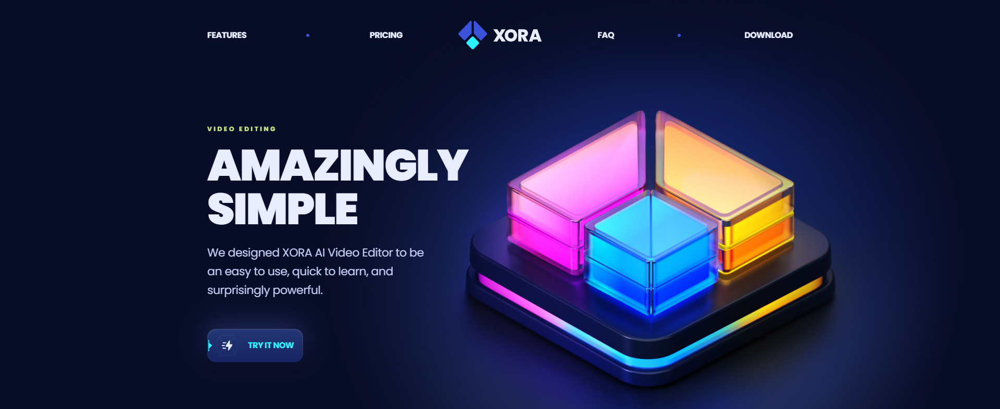
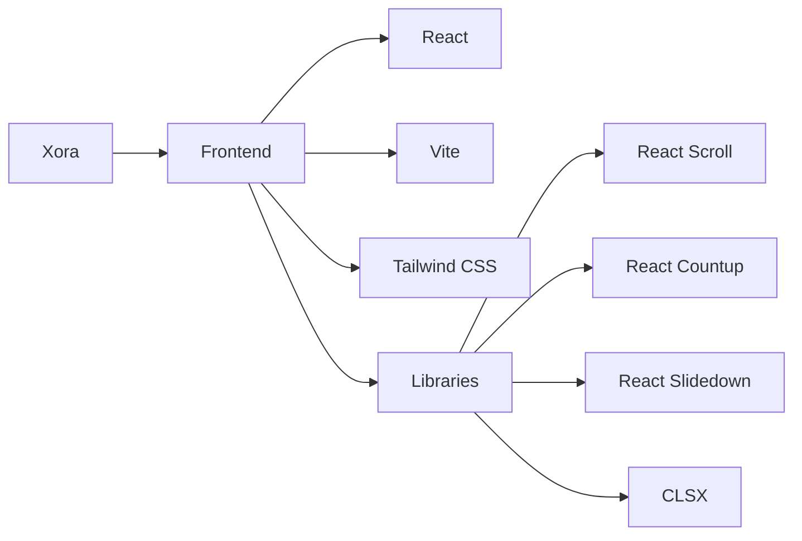

<div align="center">

# 🎬 XORA

### _AI-Powered Video Editing Made Simple_

[](https://reactjs.org/)
[](https://vitejs.dev/)
[](https://tailwindcss.com/)
[](https://opensource.org/licenses/MIT)

<!-- Add a screenshot of your landing page below. Replace the placeholder text and URL with your actual image -->

[//]: # "Remember to add your landing page screenshot"



</div>

---

## ✨ Features

<table>
<tr>
<td width="50%">

### Design & Interface

- 🎨 Modern UI/UX with fluid animations
- 📱 Responsive across all devices
- 🎯 Smooth scrolling navigation
- 💅 Sleek Tailwind styling

</td>
<td width="50%">

### Functionality

- ⚡ Lightning-fast Vite performance
- 🔄 Interactive pricing calculator
- 📊 Animated statistics counters
- 📝 Dynamic FAQ accordions

</td>
</tr>
</table>

## 🛠️ Tech Stack

Our cutting-edge stack ensures optimal performance and developer experience:



## 🚀 Quick Start

Get up and running in minutes:

```bash
# Clone the repository
git clone https://github.com/AvishkaGihan/xora-saas-landing.git

# Navigate to project directory
cd xora-saas-landing

# Install dependencies
npm install

# Start development server
npm run dev
```

Your site will be available at `http://localhost:5173` 🎉

## 📜 Available Scripts

| Command           | Description              |
| ----------------- | ------------------------ |
| `npm run dev`     | Start development server |
| `npm run build`   | Create production build  |
| `npm run preview` | Preview production build |
| `npm run lint`    | Run ESLint checks        |

## 📁 Project Structure

```
xora-saas-landing/
├── 📂 public/
│   └── 📂 images/
├── 📂 src/
│   ├── 📂 components/
│   ├── 📂 constants/
│   ├── 📂 sections/
│   ├── 📄 App.jsx
│   ├── 📄 index.css
│   └── 📄 main.jsx
├── 📄 index.html
├── 📄 package.json
├── 📄 tailwind.config.js
└── 📄 vite.config.js
```

## 🌐 Deployment

Ready to show your work to the world? Deploy to GitHub Pages:

1. Update `vite.config.js`:

```js
export default defineConfig({
  base: "/your-repo-name/",
  // ... other config
});
```

2. Build and deploy:

```bash
npm run build
```

## 🤝 Contributing

Contributions are what make the open-source community an amazing place to learn, inspire, and create. Any contributions you make are **greatly appreciated**.

1. Fork the Project
2. Create your Feature Branch (`git checkout -b feature/AmazingFeature`)
3. Commit your Changes (`git commit -m 'Add some AmazingFeature'`)
4. Push to the Branch (`git push origin feature/AmazingFeature`)
5. Open a Pull Request

## 📝 License

Distributed under the MIT License. See `LICENSE` for more information.

---

<div align="center">

Made with ❤️ by [Avishka Gihan](https://github.com/AvishkaGihan)

</div>
